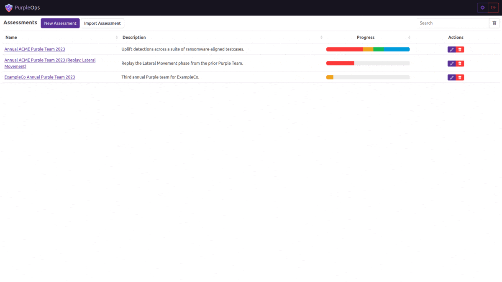

<h1 align="center">
  <br>
  <a href="https://purpleops.app"></a>
  <br>
  PurpleOps
  <br>
</h1>

<h4 align="center">An open-source self-hosted purple team management web application.</h4>

<p align="center">
  <a href="LICENSE">
  <a href="https://docs.purpleops.app">
</p>

<p align="center">
  <a href="#key-features">Key Features</a> •
  <a href="#installation">Installation</a> •
  <a href="#contact-us">Contact Us</a> •
  <a href="#credits">Credit</a> •
  <a href="#license">License</a>
</p>

<p align="center">
  
</p>

## Key Features

* Template engagements and testcases
* Framework friendly
* Role-based Access Control & MFA
* Inbuilt DOCX reporting + custom template support

How PurpleOps is different:

* No attribution needed
* Hackable, no "no-reversing" clauses
* No over complications with tomcat, redis, manual database transplanting and an obtuce permission model

## Installation

### Default

```bash
# Clone this repository
$ git clone https://github.com/CyberCX-STA/PurpleOps

# Go into the repository
$ cd PurpleOps

# Alter PurpleOps settings (if you want to customize anything but should work out the box)
$ nano .env

# Run the app with docker (add `-d` to run in background)
$ sudo docker compose up

# PurpleOps should now by available on http://localhost:5000, it is recommended to add a reverse proxy such as nginx or Apache in front of it if you want to expose this to the outside world.
```

<details>
  <summary><h3>Kali</h3></summary>
  
  ```bash
  # Install docker-compose
  sudo apt install docker-compose -y
  
  # Clone this repository
  $ git clone https://github.com/CyberCX-STA/PurpleOps
  
  # Go into the repository
  $ cd PurpleOps
  
  # Alter PurpleOps settings (if you want to customize anything but should work out the box)
  $ nano .env
  
  # Run the app with docker (add `-d` to run in background)
  $ sudo docker-compose up
  
  # PurpleOps should now by available on http://localhost:5000, it is recommended to add a reverse proxy such as nginx or Apache in front of it if you want to expose this to the outside world.
  ```
</details>

<details>
  <summary><h3>Manual</h3></summary>
  
  ```bash
  # Alternatively
  $ sudo docker run --name mongodb -d -p 27017:27017 mongo
  $ pip3 install -r requirements.txt
  $ python3 seeder.py
  $ python3 purpleops.py
  ```
</details>

<details>
  <summary><h3>NGINX Reverse Proxy + Certbot</h3></summary>

  Replace 2x `purpleops.example.com` with your FQDN and ensure your box is open internet-wide on 80/443.
  
  ```bash
  sudo apt install nginx certbot python3-certbot-nginx -y
  sudo nano /etc/nginx/sites-available/purpleops # Paste below file
  sudo ln -s /etc/nginx/sites-available/purpleops /etc/nginx/sites-enabled/
  sudo certbot --nginx -d purpleops.example.com
  sudo service nginx restart
  ```

  ```
  server {
    listen 80;
    server_name purpleops.example.com;

    location / {
        proxy_pass http://localhost:5000;
        proxy_set_header Host $host;
        proxy_set_header X-Real-IP $remote_addr;
    }
  }
  ```
</details>

<details>
  <summary><h3>IP Whitelisting with ufw</h3></summary>
  
  ```bash
  sudo apt install ufw -y
  sudo ufw allow 22
  sudo ufw deny 80
  sudo ufw deny 443
  sudo ufw insert 1 allow from 100.100.100.100/24 to any port 443
  sudo ufw enable
  ```
</details>

## Contact Us

We would love to hear back from you, if something is broken or have and idea to make it better add a ticket or connect to us on [PurpleOps Discord](https://discord.gg/2xeA6FB3GJ) or pops@purpleops.app | `@_w_m__` 

## Credits

- Atomic Red Team [(LICENSE)](https://github.com/redcanaryco/atomic-red-team/blob/master/LICENSE.txt) for sample commands
- [CyberCX](https://cybercx.com.au/) for foundational support

## License

Apache
